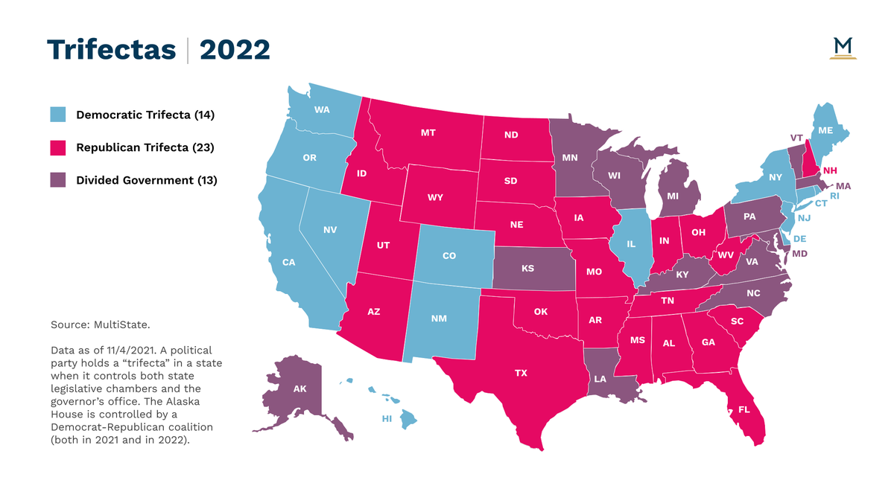

[![Contributors][contributors-shield]][contributors-url]
[![Forks][forks-shield]][forks-url]
[![Stargazers][stars-shield]][stars-url]
[![Issues][issues-shield]][issues-url]
[![LinkedIn][linkedin-shield]][linkedin-url]


<!-- PROJECT LOGO -->
<br />
<div align="center">
  <a href="https://github.com/awright813/state_politics">
    
  </a>

<h3 align="center">State Politics</h3>

  <p align="center">
    Brief EDA and hypothesis testing to examine the relationship between political control of state legislatures and state economic growth
    <br />
    <br />
    <a href="https://github.com/awright813/state_politics"><strong>Explore the docs »</strong></a>
    <br />
    <br />
    ·
    <a href="https://github.com/awright813/state_politics/issues">Report Bug</a>
    ·
    <a href="https://github.com/awright813/state_politics/issues">Request Feature</a>
    ·
  </p>
</div>


<!-- TABLE OF CONTENTS -->
<details>
  <summary>Table of Contents</summary>
  <ol>
    <li>
      <a href="#about-the-project">About The Project</a>
      <ul>
        <li><a href="#built-with">Built With</a></li>
      </ul>
    </li>
    <li>
      <a href="#getting-started">Getting Started</a>
      <ul>
        <li><a href="#prerequisites">Prerequisites</a></li>
        <li><a href="#installation">Installation</a></li>
      </ul>
    </li>
    <li><a href="#usage">Usage</a></li>
    <li><a href="#roadmap">Roadmap</a></li>
    <li><a href="#contributing">Contributing</a></li>
    <li><a href="#license">License</a></li>
    <li><a href="#contact">Contact</a></li>
    <li><a href="#acknowledgments">Acknowledgments</a></li>
  </ol>
</details>


<!-- ABOUT THE PROJECT -->
## About The Project

"There are 39 'trifecta' states, in which a single party controls all three branches of government (both chambers of the legislature and the governor's office). This allows states to 'make decisions and make them relatively quickly', says Peverill Squire of the University of Missouri, an expert on legislatures. 'The contrast with Washington will be stark.'" - The Economist, January 2023

**Project Question**

In states with "trifecta" legislatures, where one party can pursue its legislative agenda freely, what is the impact on the state's economic growth?

**Data**

Ballotpedia State Government Trifecta Status - https://ballotpedia.org/State_government_trifectas  
Federal Reserve Bank of St. Louis GDP by State - https://fred.stlouisfed.org/release?rid=140  
World Bank US GDP Growth - https://data.worldbank.org/indicator/NY.GDP.MKTP.KD.ZG?locations=US

<p align="right">(<a href="#readme-top">back to top</a>)</p>


### Built With

* 
* 
* 
* 
* 

<p align="right">(<a href="#readme-top">back to top</a>)</p>


<!-- GETTING STARTED -->
## Getting Started

This is an example of how you may give instructions on setting up your project locally.
To get a local copy up and running follow these simple example steps.

### Prerequisites

See [requirements](https://github.com/awright813/state_politics/blob/95cb2e3fc9ca67519c7ffb0853d4a04242783640/requirements.txt)

### Installation

1. Clone the repo
   ```sh
   git clone https://github.com/awright813/state_politics.git
   ```
2. Install all requirements, including import-ipynb package
   ```sh
   pip install import-ipynb
   ```

<p align="right">(<a href="#readme-top">back to top</a>)</p>


<!-- CONTRIBUTING -->
## Contributing

If you have a suggestion that would make this better, please fork the repo and create a pull request. You can also simply open an issue with the tag "enhancement".

Don't forget to give the project a star! Thanks again!

1. Fork the Project
2. Create your Feature Branch (`git checkout -b feature/AmazingFeature`)
3. Commit your Changes (`git commit -m 'Add some AmazingFeature'`)
4. Push to the Branch (`git push origin feature/AmazingFeature`)
5. Open a Pull Request

<p align="right">(<a href="#readme-top">back to top</a>)</p>


<!-- CONTACT -->
## Contact

Andrea Wright - [@twitter_handle](https://twitter.com/twitter_handle) - andreawright0813@gmail.com

Project Link: [https://github.com/awright813/state_politics](https://github.com/awright813/state_politics)

<p align="right">(<a href="#readme-top">back to top</a>)</p>


<!-- MARKDOWN LINKS & IMAGES -->
<!-- https://www.markdownguide.org/basic-syntax/#reference-style-links -->
[contributors-shield]: https://img.shields.io/github/contributors/awright813/state_politics.svg?style=for-the-badge
[contributors-url]: https://github.com/awright813/state_politics/graphs/contributors
[forks-shield]: https://img.shields.io/github/forks/awright813/state_politics.svg?style=for-the-badge
[forks-url]: https://github.com/awright813/state_politics/network/members
[stars-shield]: https://img.shields.io/github/stars/awright813/state_politics.svg?style=for-the-badge
[stars-url]: https://github.com/awright813/state_politics/stargazers
[issues-shield]: https://img.shields.io/github/issues/awright813/state_politics.svg?style=for-the-badge
[issues-url]: https://github.com/awright813/state_politics/issues
[license-shield]: https://img.shields.io/github/license/awright813/state_politics.svg?style=for-the-badge
[license-url]: https://github.com/awright813/state_politics/blob/master/LICENSE.txt
[linkedin-shield]: https://img.shields.io/badge/-LinkedIn-black.svg?style=for-the-badge&logo=linkedin&colorB=555
[linkedin-url]: https://linkedin.com/in/andreawright8
